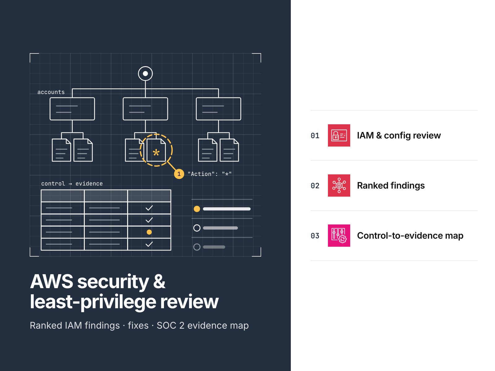

# AWS IAM security review: sample deliverable

This least-privilege IAM and security review covers one AWS account. Each finding has a risk ranking,
reproducible evidence and a fix expressed as code.

[](https://github.com/gamaware/aws-iam-security-review-sample/actions/workflows/ci.yml)
[](LICENSE)




> **This repository contains only fictional material.** The invented mid-size retailer Harbor Goods uses
> AWS documentation example account ID `111122223333`; its analytics vendor uses example ID `999988887777`.
> The Terraform under `data/synthetic/before/` contains deliberate security weaknesses. Never apply it.

## Executive summary

The checker returned 27 raw hits for the Harbor Goods account. The review consolidated them into 9 findings:

| Severity | Findings | Examples |
| --- | --- | --- |
| Critical | 3 | CI role is administrator and trusts every repository; root has an active key and no MFA; public customer exports |
| High | 4 | Admins without MFA; a group that can make itself administrator; keys up to 716 days old; single-region CloudTrail |
| Medium | 1 | An undocumented account with full control of a bucket |
| Low | 1 | Buckets accept plain HTTP and lack a storage baseline |

Top three recommendations:

1. **Restrict the CI role** with `StringEquals` so that only one repository and one GitHub environment can use it.
   Limit its permissions to a single bucket prefix and a single Lambda function.
2. **End routine root use** by removing the root access key, enabling MFA and configuring an alarm for each root
   sign-in.
3. **Remove public access** by enabling the S3 public access block. Replace grants to anonymous users and account
   roots with a grant to one role restricted to its own prefix.

With the fixes in place, rerunning the checker yields **0 findings**; Checkov returns **0 failed checks**.

## Inspect the deliverable

| Artifact | What to look at |
| --- | --- |
| [Security review report](report/REPORT.md) | Executive summary, nine ranked findings with evidence, impact, fix and policy rewrite, quick wins, SCP recommendation |
| [SOC 2 control to evidence map](report/control-evidence-map.md) | Trust Services Criteria linked to the AWS control and evidence file, before and after. A map, not an audit opinion |
| [Evidence](evidence/) | Unedited tool output the report quotes, regenerated and diffed on every CI run |
| [Fixes as code](remediation/) | Least-privilege policy documents, a baseline SCP, and the same changes as Terraform |
| [Checker](scripts/iam_review.py) | 17 offline checks in Python's standard library, about 500 lines |
| [Methodology](docs/methodology.md) | Access model, triage from raw hits to findings, severity scale, verification levels |

The [report PDF](report/REPORT.pdf) combines the report and the control map. CI rebuilds it on every run with the
shared pandoc workflow.

## Scenario and acceptance criteria

A single AWS account hosts the Harbor Goods reporting application. The company wants an independent assessment
of account permissions before it signs a data-sharing contract with an analytics vendor. It also needs fixes
that its team can apply. The reviewer receives read-only exports and Terraform for the account, with no credentials.

Completion requires the following:

- Every finding references a check ID, its source file or resource, and a tool-output line that anyone can reproduce.
- Each finding has a risk ranking, an explanation of its impact and a specific remediation.
- Every remediation includes both a policy document and Terraform; the same tools must find no issues in the fixed
  state.
- The report identifies the areas outside the review's scope.

## Architecture


In steps 1-2, the client's engineer executes read-only export commands and gives the resulting files and Terraform
to the reviewer. The reviewer uses the repository's toolkit offline in step 3, then delivers the report, evidence
and code fixes in step 4. Harbor Goods applies those fixes through its own pull requests in step 5.
The vendor account sits outside the diagram's boundary because its bucket access is a finding in the review.
The [evidence pipeline](docs/diagrams/review-pipeline.png) traces the production and verification of every report
number. The draw.io source files for the diagrams reside in [`docs/diagrams/`](docs/diagrams/).

## Verify locally

Running the toolkit requires Python 3.11 or newer (3.13 in CI), [uv](https://docs.astral.sh/uv/) for pinned Checkov
3.3.19, Terraform 1.10 or newer (1.14.5 in CI), and `make`. Neither an AWS account nor credentials are required.

```bash
git clone https://github.com/gamaware/aws-iam-security-review-sample.git
cd aws-iam-security-review-sample
python3 -m venv .venv && .venv/bin/pip install -r requirements-dev.txt
make verify PYTHON=.venv/bin/python
```

`make verify` executes pytest and reviews both the before and after states. It also runs both Checkov gates,
Terraform fmt and validate, and a check that the evidence is reproducible. Its final output is:

```text
evidence/ matches a fresh run
verify: all checks passed
```

Allow about two minutes for the initial run. Most of that time goes to fetching Checkov through `uvx` and
downloading the AWS provider through `terraform init`. Subsequent runs finish in less than a minute.
To inspect the findings yourself, run `python3 scripts/iam_review.py data/synthetic/before/export`.

With Docker running, `make report` regenerates `report/REPORT.pdf` with the same pandoc image CI uses. The optional
`make test-live` command runs a manual check against a non-production AWS account. Instructions are in
[the methodology](docs/methodology.md#running-the-live-test).

## Repository map

```text
report/            REPORT.md (canonical deliverable) and the SOC 2 control to evidence map
evidence/          unedited tool output the report quotes; regenerated by make evidence
data/synthetic/    Harbor Goods exports and Terraform: before (insecure on purpose) and after
remediation/       fixes as code: policy documents, baseline SCP, Terraform with a secure-bucket module
scripts/           iam_review.py, checkov_summary.py, test-live.sh
tests/             unit tests per check, fixture runs, policy and report consistency
docs/              methodology, ADRs, diagrams, cover image
```

## Decisions and trade-offs

| ADR | Title | Status |
| --- | --- | --- |
| [0001](docs/adr/0001-review-offline-exports.md) | Review read-only exports offline, not the live account | Accepted |
| [0002](docs/adr/0002-stdlib-checker-alongside-checkov.md) | A stdlib-only Python checker alongside Checkov | Accepted |
| [0003](docs/adr/0003-soc2-evidence-map-not-opinion.md) | The SOC 2 deliverable is an evidence map, not an opinion | Accepted |
| [0004](docs/adr/0004-keep-vulnerable-sample-out-of-the-gate.md) | Gate the remediated code; assert the before state still fails | Accepted |
| [0005](docs/adr/0005-markdown-report-pdf-built-in-ci.md) | Markdown is the canonical report; the shared pipeline builds the PDF | Accepted |

## Security and quality gates

| Gate | Where | Why |
| --- | --- | --- |
| `make verify` | CI and locally | The report cannot drift from the tools: the before state must fail with exactly the cited evidence, the after state must be clean |
| Report tests | pytest | Every quoted line exists in the evidence, severity counts match, links resolve, only documentation account IDs appear |
| Checkov on `remediation/` | pre-commit and CI | Fixes must pass with no failed checks; the five skips carry their reason next to the resource |
| gitleaks, detect-secrets | pre-commit and CI | No credentials in a repository full of IAM examples |
| Semgrep, Trivy | CI | Code and configuration scanning of the scripts and Terraform |
| actionlint, zizmor | pre-commit and CI | Workflows run with `permissions: {}`, SHA-pinned actions and no cloud credentials |
| markdownlint, ruff, shellcheck, shellharden, tflint | pre-commit and CI | Consistent, reviewable docs and code |

Checks assert the deliberately insecure fixtures as expected findings; they never exclude those fixtures as a group.
[ADR 0004](docs/adr/0004-keep-vulnerable-sample-out-of-the-gate.md) records this decision.

## Limits and production adaptations

- **The workflow applies nothing to AWS.** It validates and scans the remediated Terraform without deploying it.
  The optional live test uses AWS's own evaluators to check policy documents and creates no resources.
- **The checker detects patterns and does not evaluate IAM policies.** Its model excludes SCPs, permission boundaries
  and session policies, and does not cover every condition operator. A reviewer assesses each hit; that assessment
  accounts for the reduction from 27 hits to 9 findings.
- **Exports capture one point in time.** Exported AWS-managed policies include only the relevant statements.
- **Statement Sid provides the consistency check between JSON and Terraform copies.** That check does not parse HCL.
  Checkov and review catch changes to actions within a statement.
- **An actual engagement also includes** Security Hub or Prowler across up to three accounts, IAM Access Analyzer
  unused-access findings, and review of SCPs in AWS Organizations. It includes a readout call and fixes submitted
  as pull requests to the client's repository, followed by a re-scan.

## Related work

This repository belongs to the [AWS DevOps portfolio](https://github.com/gamaware/aws-devops-portfolio) and supports
the "AWS security review with least-privilege IAM fixes" service, offered through
[Alex Garcia on Upwork](https://www.upwork.com/freelancers/~014b3520cf9e140103). The method is the one Alex Garcia
uses in audits for ITESO and freelance clients in Guadalajara. All findings in this example were invented for
Harbor Goods.

The repository uses the [MIT](LICENSE) license and inherits its contribution, support and security policies from
[gamaware/.github](https://github.com/gamaware/.github). Additional information appears in
[SECURITY.md](SECURITY.md) and [CHANGELOG.md](CHANGELOG.md).
