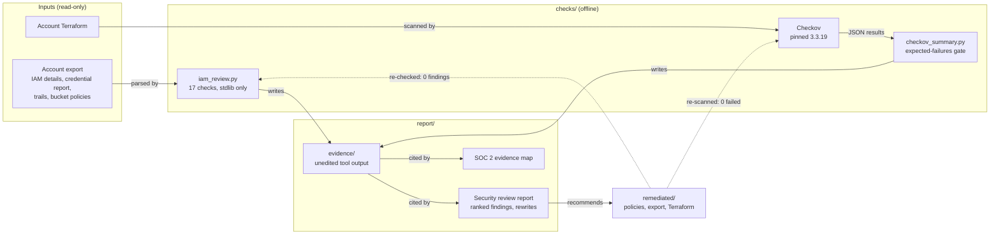

# AWS IAM Security Review: Sample Deliverable

[](https://github.com/gamaware/aws-iam-security-review-sample/actions/workflows/ci.yml)
[](LICENSE)

[](docs/adr/README.md)

> **Everything in this repository is fictional.** The account (`123456789012`), the partner account
> (`111122223333`), the company and the people are placeholders. The insecure Terraform in `sample-account/` is
> for review only and must never be applied.

**Service:** AWS security and least-privilege review, with IAM findings and a SOC 2 evidence map.

A client hires a reviewer to look at an AWS account's IAM and security configuration. This repository is a complete,
reproducible example of what they get back:

- [**Security review report**](report/REPORT.md): executive summary, nine findings ranked by risk,
  each with its evidence, impact, fix and least-privilege policy rewrite; then quick wins, planned work and scope.
- [**SOC 2 control to evidence map**](report/control-evidence-map.md): Trust Services Criteria (CC6.1 to CC9.2)
  linked to the AWS control and the evidence file, with a status before and after remediation. An evidence map, not
  an audit opinion.
- [**Remediated policies and Terraform**](remediated/): the rewrites, proven by the same checks that flagged the
  original.

## What this proves

- **Findings are evidence, not opinion.** Every finding quotes the output of a check that anyone can re-run.
  `make review` fails if the checker's output drifts from the evidence the report cites.
- **Least privilege is concrete.** The CI role goes from `*` on `*` with any repo in the org to one repository, one
  environment, one bucket prefix and one Lambda function. `iam:PassRole` goes from `*` to `role/app-*`, EC2 only,
  with MFA.
- **Fixes are verified the same way the problems were found.** The remediated export reports 0 findings and the
  remediated Terraform passes Checkov, with five skips, each justified next to its resource.
- **Compliance language stays accurate.** SOC 2 criteria are cited by ID, the map separates design from operating
  evidence, and it says plainly that only a CPA firm issues an opinion.
- **Reviewable engineering.** A stdlib-only checker with 60+ tests, CI with `permissions: {}` and SHA-pinned actions,
  actionlint, zizmor, gitleaks and ADRs with Compliance sections.

## How it works



**Key:** boxes are files or tools in this repository; grouped boxes share a folder. Solid arrows show data flowing
from the account to the report. Dashed arrows show the remediated state going back through the same checks. Nothing
in the diagram calls AWS.

## Run it

Requirements: Python 3.11 or later, [uv](https://docs.astral.sh/uv/) (runs the pinned Checkov), Terraform 1.10 or
later (only for `make terraform`), and `make`.

```bash
git clone https://github.com/gamaware/aws-iam-security-review-sample.git
cd aws-iam-security-review-sample
python3 -m venv .venv && .venv/bin/pip install -r requirements-dev.txt

make test PYTHON=.venv/bin/python        # pytest: unit tests, fixture tests, report consistency
make review PYTHON=.venv/bin/python      # sample: findings identical to the evidence; remediated: none
make checkov                             # remediated passes; sample fails with exactly the expected checks
make terraform                           # fmt and validate both Terraform roots

python3 scripts/iam_review.py data/synthetic/before/export   # read the findings yourself
```

`make all` runs the four targets. The first `terraform init` downloads the AWS provider (several hundred MB); nothing
else touches the network apart from `uvx` fetching Checkov once.

## Repository layout

| Path | Contents |
| --- | --- |
| [`sample-account/`](sample-account/) | The fictional "before" state: Terraform and read-only exports with planted findings |
| [`checks/`](checks/) | `iam_review.py`, `checkov_summary.py` and their tests; notes on Parliament and IAM Access Analyzer |
| [`report/`](report/) | The report, the SOC 2 map and the evidence they cite |
| [`remediated/`](remediated/) | Least-privilege policies, the "after" export and Terraform with a `secure-bucket` module |
| [`docs/adr/`](docs/adr/README.md) | Architecture decisions: offline exports, stdlib checker, evidence map, gating |

## Honest limits

- **Nothing is applied to AWS.** Terraform is validated and scanned, not deployed, so runtime behavior (for example
  that the partner role can list only its prefix) is not tested against a live account.
- **The checker flags patterns; it is not an IAM policy evaluator.** It does not model SCPs, permission boundaries,
  session policies or every condition operator. A reviewer judges each hit, which is why the report groups 27 raw
  hits into 9 findings.
- **Exports are a snapshot.** Findings describe the account at the snapshot time. The report lists what the exports
  do not contain (SCPs, IAM Identity Center, other resource policies, actual permission usage).
- **AWS-managed policies are abridged** in the sample export to the statements that matter here.
- **The Terraform and JSON copies of each rewrite are compared by statement Sid, not parsed from HCL.** A changed
  action inside a statement is caught by Checkov and review, not by the consistency test.
- **SOC 2:** the map supports an auditor; it is not an attestation and does not cover governance, risk assessment
  or availability criteria.

## Contributing and security

See [CONTRIBUTING.md](CONTRIBUTING.md), [SECURITY.md](SECURITY.md) and [CHANGELOG.md](CHANGELOG.md). Licensed under
[MIT](LICENSE).
